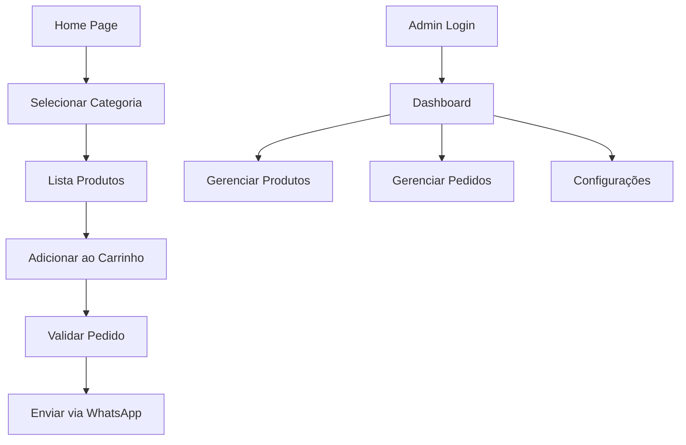

## 1. Product Overview
Aplicação mobile-first para pizzaria siciliana com menu digital, pedidos via WhatsApp e painel administrativo. Permite aos clientes visualizar produtos, montar pedidos com lógica especial para pizzas inteiras/meias, e enviar pedidos via WhatsApp. O administrador pode gerenciar produtos, estoque e pedidos.

## 2. Core Features

### 2.1 User Roles
| Role | Registration Method | Core Permissions |
|------|---------------------|------------------|
| Cliente | Não requer registro | Visualizar menu, adicionar produtos, enviar pedidos via WhatsApp |
| Administrador | Login com email/senha | CRUD produtos, gerenciar estoque, visualizar pedidos, configurar sistema |

### 2.2 Feature Module
Nossa aplicação de pizzaria consiste nas seguintes páginas principais:
1. **Página Inicial**: Logo central, 4 cards de categorias (Pizzas, Salames, Conservas, Sobremesas)
2. **Lista de Produtos**: Grid de produtos com foto, nome, descrição, preço e botão adicionar
3. **Carrinho**: Lista produtos selecionados, validações de pedido, total atualizado
4. **Painel Admin**: Login, dashboard, CRUD produtos, gestão pedidos, configurações

### 2.3 Page Details
| Page Name | Module Name | Feature description |
|-----------|-------------|---------------------|
| Página Inicial | Logo e título | Mostrar logo Mediterranea e subtítulo Pizzeria Siciliana centralizados |
| Página Inicial | Cards categorias | 4 cards grandes clicáveis com emojis para navegação rápida |
| Lista Produtos | Grid produtos | Exibir produtos em grid responsivo com foto, nome, descrição breve, preço |
| Lista Produtos | Adicionar produto | Botão "Adicionar ao pedido" para cada produto com validação específica |
| Lista Produtos | Seleção pizza | Permitir escolha entre pizza inteira ou meia pizza com preços diferentes |
| Carrinho | Lista produtos | Mostrar todos produtos adicionados com quantidades e valores |
| Carrinho | Validações pizza | Verificar mínimo 1 pizza inteira, meias pares, preço meias configurável |
| Carrinho | Total pedido | Calcular e exibir total atualizado em tempo real |
| Carrinho | Enviar WhatsApp | Botão abre WhatsApp com mensagem pré-formatada e número configurável |
| Painel Admin | Login | Form simples email/senha ou URL secreta com sessão persistente |
| Painel Admin | Dashboard | Visualizar resumo pedidos, contador diário, acesso rápido categorias |
| Painel Admin | CRUD Produtos | Criar, editar, deletar, ativar/desativar produtos por categoria |
| Painel Admin | Upload fotos | Upload mobile com preview, compressão automática, substituir/remover |
| Painel Admin | Gestão pedidos | Listar pedidos, mudar status (Recebido, Em preparo, Finalizado, Cancelado) |
| Painel Admin | Estoque automático | Diminuir quantidade produtos não-pizza ao confirmar pedido, marcar esgotado |
| Painel Admin | Configurações | Número WhatsApp, regra preço meias (mais cara ou média) |

## 3. Core Process
### Fluxo Cliente
O cliente acessa a home page, escolhe uma categoria via card grande, visualiza produtos em grid, adiciona itens ao carrinho. Para pizzas, seleciona inteira ou meia com validações específicas. No carrinho, revisa pedido com validações automáticas (mínimo 1 pizza inteira, meias pares). Envia pedido via WhatsApp com mensagem pré-formatada.

### Fluxo Administrador
Admin faz login no painel, acessa dashboard com visão geral pedidos. Gerencia produtos via CRUD completo com upload fotos. Acompanha pedidos atualizando status. Configura número WhatsApp e regras preço meias. Sistema gerencia estoque automaticamente para produtos não-pizza.

## 4. User Interface Design

### 4.1 Design Style
- **Cores primárias**: Vermelho Mediterranea (#D32F2F), Branco (#FFFFFF)
- **Cores secundárias**: Cinza claro (#F5F5F5), Preto texto (#212121)
- **Botões**: Estilo arredondado, grande para mobile, cores vibrantes
- **Fontes**: Roboto ou similar, títulos 24px, texto 16px, pequeno 14px
- **Layout**: Card-based, navegação inferior fixa, espaçamento generoso
- **Ícones**: Emojis coloridos nas categorias, ícones minimalistas nos botões

### 4.2 Page Design Overview
| Page Name | Module Name | UI Elements |
|-----------|-------------|-------------|
| Home page | Logo section | Logo Mediterranea 120px centrado, subtítulo em cinza escuro |
| Home page | Category cards | Cards 150x150px com sombra suave, emojis 48px, título 18px bold |
| Product list | Product cards | Cards 300px largura, imagem 200px altura, borda arredondada 12px |
| Product list | Add button | Botão largura total, altura 48px, verde vibrante, texto 16px bold |
| Cart page | Item list | Cards brancos com borda cinza, quantidade em badge vermelho |
| Cart page | Total bar | Barra fixa inferior, fundo branco, total em vermelho 24px bold |
| Admin panel | Sidebar | Menu lateral 250px, ícones 24px, texto 14px, hover cinza claro |
| Admin panel | Forms | Inputs altura 48px, bordas arredondadas, labels acima 14px |

### 4.3 Responsiveness
Mobile-first design, totalmente responsivo. Touch-optimized com botões mínimo 48px altura, espaçamento 16px entre elementos. Cards empilham verticalmente em telas pequenas, grid adaptativo em tablets. Navegação inferior fixa em mobile para fácil acesso com polegar.