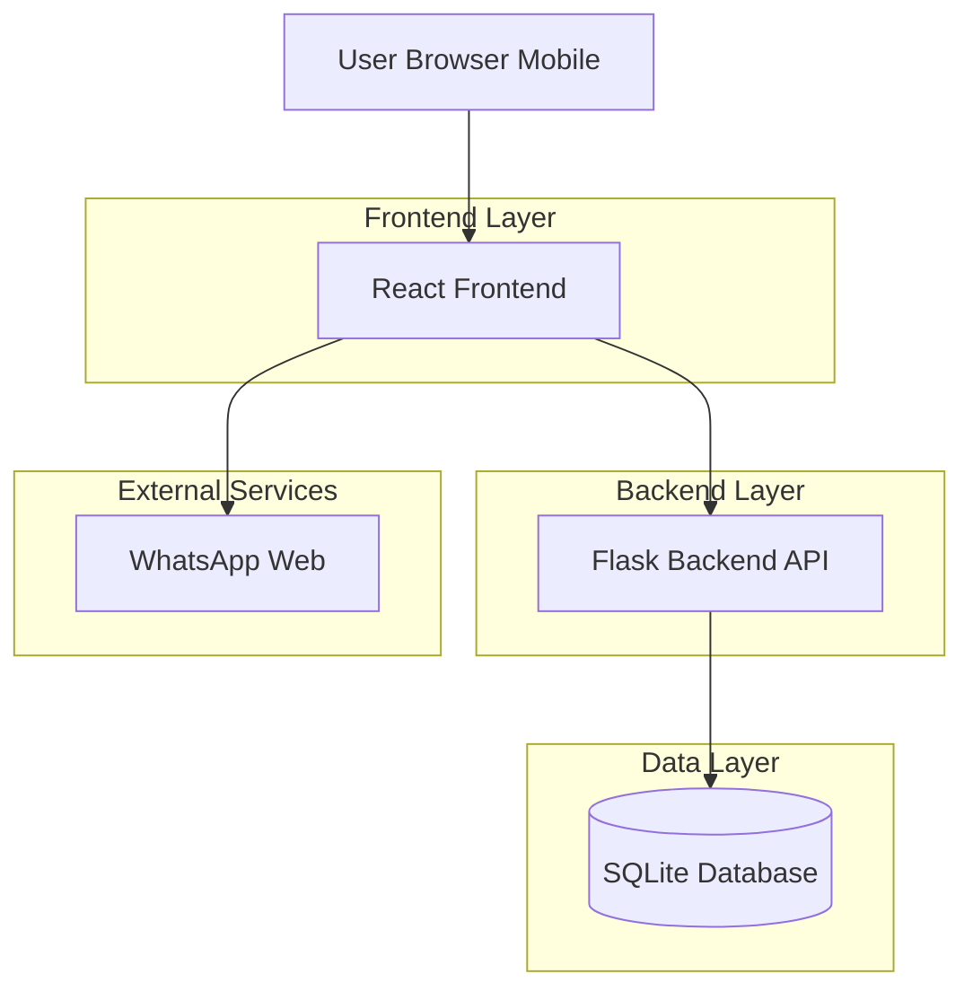
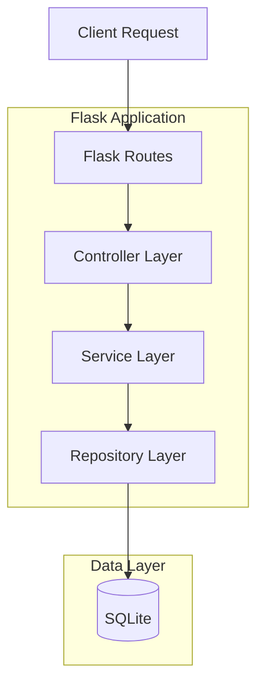
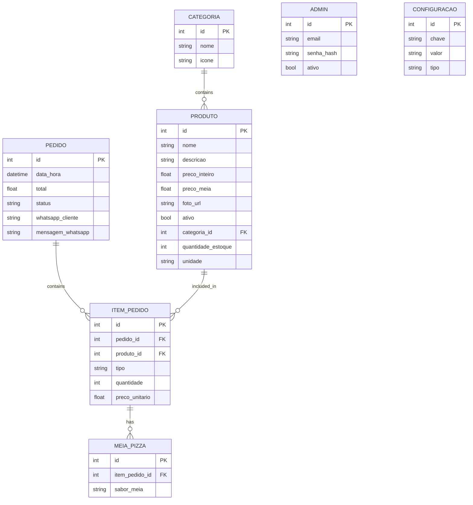

## 1. Architecture design



## 2. Technology Description
- Frontend: React@18 + tailwindcss@3 + vite
- Initialization Tool: vite-init
- Backend: Flask@2 + Python@3.9
- Database: SQLite3
- Dependências essenciais: axios, react-router-dom, flask-cors, werkzeug, pillow (image processing)

## 3. Route definitions
| Route | Purpose |
|-------|---------|
| / | Home page com cards de categorias |
| /categoria/:nome | Lista produtos por categoria |
| /carrinho | Visualizar e gerenciar pedido |
| /admin | Login do painel administrativo |
| /admin/dashboard | Dashboard administrativo |
| /admin/produtos | Gerenciar produtos |
| /admin/pedidos | Gerenciar pedidos |
| /admin/configuracoes | Configurações do sistema |

## 4. API definitions

### 4.1 Products API
```
GET /api/produtos
```
Response:
```json
[
  {
    "id": 1,
    "nome": "Margherita",
    "categoria": "Pizzas",
    "descricao": "Molho de tomate, mussarela, manjericão",
    "preco_inteiro": 45.00,
    "preco_meia": 25.00,
    "foto_url": "/uploads/margherita.jpg",
    "ativo": true,
    "quantidade_estoque": null
  }
]
```

### 4.2 Orders API
```
POST /api/pedidos
```
Request:
```json
{
  "items": [
    {
      "produto_id": 1,
      "tipo": "inteira",
      "quantidade": 1,
      "meias": []
    },
    {
      "produto_id": 2,
      "tipo": "meia",
      "quantidade": 1,
      "meias": ["Calabresa", "Portuguesa"]
    }
  ],
  "total": 85.00,
  "whatsapp": "5511999999999"
}
```

### 4.3 Admin Authentication
```
POST /api/admin/login
```
Request:
```json
{
  "email": "admin@mediterranea.com",
  "senha": "senha123"
}
```

## 5. Server architecture diagram



## 6. Data model

### 6.1 Data model definition


### 6.2 Data Definition Language

```sql
-- Tabela categorias
CREATE TABLE categorias (
  id INTEGER PRIMARY KEY AUTOINCREMENT,
  nome VARCHAR(50) NOT NULL,
  icone VARCHAR(10) NOT NULL
);

-- Tabela produtos
CREATE TABLE produtos (
  id INTEGER PRIMARY KEY AUTOINCREMENT,
  nome VARCHAR(100) NOT NULL,
  descricao TEXT,
  preco_inteiro DECIMAL(10,2),
  preco_meia DECIMAL(10,2),
  foto_url VARCHAR(255),
  ativo BOOLEAN DEFAULT 1,
  categoria_id INTEGER,
  quantidade_estoque INTEGER DEFAULT NULL,
  unidade VARCHAR(20) DEFAULT 'unid',
  FOREIGN KEY (categoria_id) REFERENCES categorias(id)
);

-- Tabela pedidos
CREATE TABLE pedidos (
  id INTEGER PRIMARY KEY AUTOINCREMENT,
  data_hora DATETIME DEFAULT CURRENT_TIMESTAMP,
  total DECIMAL(10,2) NOT NULL,
  status VARCHAR(20) DEFAULT 'Recebido',
  whatsapp_cliente VARCHAR(20) NOT NULL,
  mensagem_whatsapp TEXT
);

-- Tabela itens pedido
CREATE TABLE itens_pedido (
  id INTEGER PRIMARY KEY AUTOINCREMENT,
  pedido_id INTEGER,
  produto_id INTEGER,
  tipo VARCHAR(10) CHECK (tipo IN ('inteira', 'meia')),
  quantidade INTEGER DEFAULT 1,
  preco_unitario DECIMAL(10,2),
  FOREIGN KEY (pedido_id) REFERENCES pedidos(id),
  FOREIGN KEY (produto_id) REFERENCES produtos(id)
);

-- Tabela meias pizzas
CREATE TABLE meias_pizzas (
  id INTEGER PRIMARY KEY AUTOINCREMENT,
  item_pedido_id INTEGER,
  sabor_meia VARCHAR(100),
  FOREIGN KEY (item_pedido_id) REFERENCES itens_pedido(id)
);

-- Tabela admin
CREATE TABLE admin (
  id INTEGER PRIMARY KEY AUTOINCREMENT,
  email VARCHAR(100) UNIQUE NOT NULL,
  senha_hash VARCHAR(255) NOT NULL,
  ativo BOOLEAN DEFAULT 1
);

-- Tabela configurações
CREATE TABLE configuracoes (
  id INTEGER PRIMARY KEY AUTOINCREMENT,
  chave VARCHAR(50) UNIQUE NOT NULL,
  valor TEXT,
  tipo VARCHAR(20) DEFAULT 'string'
);

-- Índices
CREATE INDEX idx_produtos_categoria ON produtos(categoria_id);
CREATE INDEX idx_produtos_ativo ON produtos(ativo);
CREATE INDEX idx_itens_pedido_pedido ON itens_pedido(pedido_id);
CREATE INDEX idx_pedidos_status ON pedidos(status);
CREATE INDEX idx_pedidos_data ON pedidos(data_hora);

-- Dados iniciais
INSERT INTO categorias (nome, icone) VALUES 
('Pizzas', '🍕'),
('Salames', '🧀'),
('Conservas', '🍯'),
('Sobremesas', '🍰');

INSERT INTO admin (email, senha_hash) VALUES 
('admin@mediterranea.com', 'scrypt:32768:8:1$...hash...');

INSERT INTO configuracoes (chave, valor, tipo) VALUES 
('whatsapp_numero', '5511999999999', 'string'),
('preco_meia_regra', 'mais_cara', 'string');
```